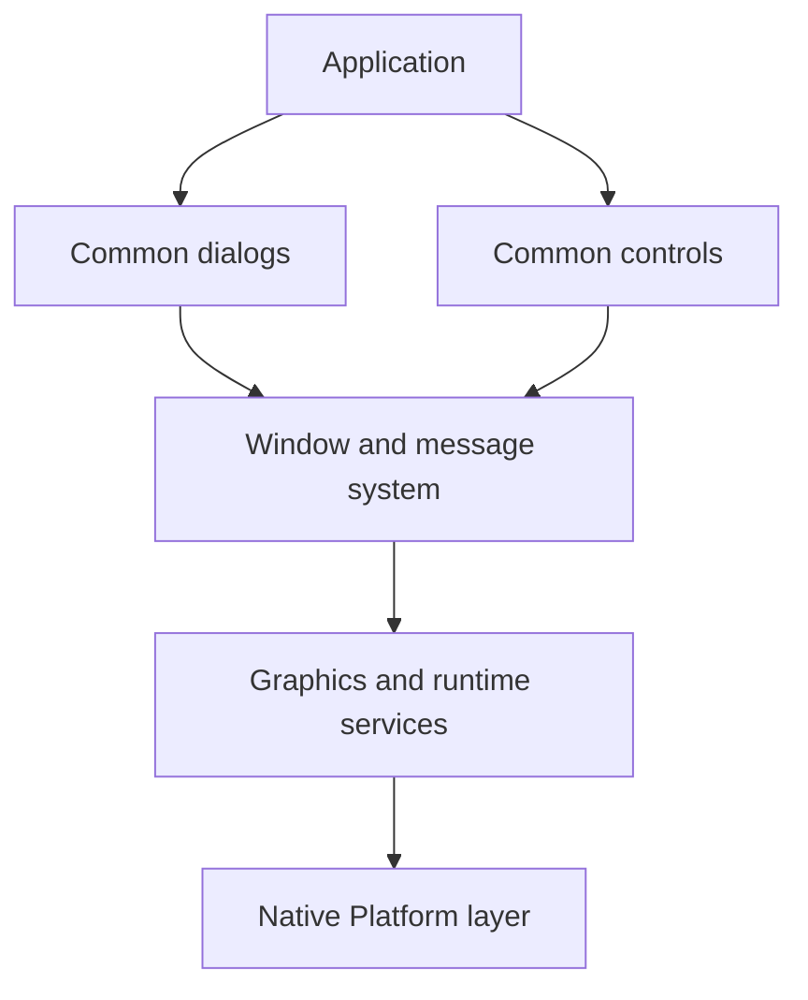

# Architecture

Orion is a standalone C UI framework with a WinAPI-style message model. The
stable architecture is organized around ownership and message boundaries, not
around individual source files.

## Layers

```text
apps/          Applications, declarative resources, app components, and tests
orion/user/    Windows, messages, input routing, drawing, forms, and resources
orion/kernel/  Graphics lifecycle, rendering, HTTP, and shared runtime services
orion/commctl/ Reusable controls and layout containers
orion/commdlg/ Modal dialogs and common pickers
platform/      Native OS windows, events, filesystems, processes, and networking
share/         Framework fonts, icons, shaders, and deployable assets
tests/         Framework behavior and integration tests
tools/         Resource compilers, generators, and release utilities
```

Dependencies point inward:



Applications should not bypass Orion to duplicate platform event routing,
window controls, timers, clipboard, or other framework-level behavior. When a
capability belongs to the UI framework, extend the owning Orion layer.

## Application Lifecycle

A substantial app normally has one source lifecycle for two deployment modes:

- **Standalone executable**: initializes graphics and owns the event loop.
- **GEM module**: creates its windows inside Orion Shell and shares Shell's
  event loop and framework state.

`GEM_DEFINE` exports the module interface. `GEM_STANDALONE_MAIN` supplies the
standard standalone initialization, accelerator-aware loop, cleanup, and
`--screenshot PATH` support. See [Getting Started](docs/getting-started.md) and
[GEM Plugin System](docs/gems.md).

## Windows And Messages

Every window has a procedure:

```c
typedef result_t (*winproc_t)(window_t *win, uint32_t msg,
                              uint32_t wparam, void *lparam);
```

Messages establish the main ownership boundary:

1. Platform receives a native event.
2. Orion translates it into an `ev*` message.
3. The window system finds the target and converts coordinates.
4. The target window procedure handles the message.
5. Child controls notify the root through `evCommand`.
6. State changes invalidate windows; drawing occurs during `evPaint`.

Use `send_message()` for synchronous behavior and `post_message()` for queued
work. Menus, toolbars, context menus, and accelerators should converge on the
same command IDs so one controller path owns each action.

Window composition keeps texture ownership and drawing in the renderer, while
the active theme owns `window_corner_radius` in logical pixels (Modern: 8,
Classic: 0). Rounded UI fills and window textures share the rounded-box SDF
shader; theme code does not rasterize corner geometry. Modern toolbar, list,
and tab backgrounds share `item_background` roles for hover, selection,
selection with hover, and press. These are UI/workbench colors, separate from
document content or syntax colors.

Modern root windows, including popups, receive a procedural shadow immediately
before their surface is composited. `draw_rect_shadow(rect, radius, blur, offset,
color)` uses logical pixels and the existing quad/SDF shader with a Gaussian-tail
approximation; no blur texture or additional framebuffer is allocated. Theme
fields `window_shadow_blur`, `window_shadow_offset`, and `window_shadow_color`
control the default appearance. Zero blur disables the shadow.
Transparent roots (`WINDOW_TRANSPARENT`), such as the workspace-sized application
chrome host, do not cast rectangular shadows through their empty content.

## Input And Coordinate Spaces

The window system owns parent-to-child routing and conversion. A window
procedure receives pointer coordinates in its own content space, including the
window's built-in scroll offset. Views must not compensate a second time.

| Space | Meaning |
|---|---|
| Platform screen | Native backend coordinates |
| Logical screen | Coordinates normalized to Orion's logical scale |
| Parent viewport | Visible area used to hit-test child frames |
| Window content | Local coordinates delivered to the target procedure |

Hit-test a child frame in parent viewport space, then convert to child content
space for delivery. Non-client areas such as title bars, built-in toolbars, and
scrollbars are intercepted by the window system before ordinary client input.
See [Window System](docs/window-system.md) and
[Messages & Events](docs/messages.md).

Two-finger transforms follow the same boundary: the iPad backend queues an
inline `ax_gesture_t` (centroid, previous centroid, incremental scale and
clockwise rotation). `event.c` routes `evGesture` through the child hierarchy,
converts both points into content coordinates, and retains the accepting window
until end/cancel. Unhandled gestures fall back to two-finger scrolling.
`evPointerCancel` aborts the first finger's interaction before a gesture begins.
Apple Pencil strokes retain priority over finger gestures.

Canvas scale, rotation and translation belong to `canvas_win_state_t`, not the
image model. `canvas_coords.c` owns forward/inverse mappings and anchored gesture
updates. Painting scopes a renderer projection transform around image content
and overlays, then restores it before drawing viewport UI. The window system
continues to own clipping; rotated views do not implement their own event router.

## Controls And Notifications

Controls are ordinary windows with registered classes and message contracts.
They own local interaction state and send notifications through `evCommand`:

```c
case evCommand:
  if (LOWORD(wparam) == ID_SAVE && HIWORD(wparam) == btnClicked) {
    app_save_document();
    return true;
  }
  return false;
```

This keeps application policy out of reusable controls. A control may expose
control-specific messages, but model mutation and workflow decisions stay in
the application controller. See [Controls](docs/controls.md).

## Declarative UI And Resources

`.orion` XML is the canonical representation for static forms, menus, toolbars,
accelerators, databases, and bindings. `orionc` compiles it into typed C
metadata.

Declarative resources are self-contained. A field such as
`field="db.posts.title"` names its database, table, and column; the form resolves
registered resources by name instead of requiring the caller to pass duplicate
context. This makes definitions serializable, previewable, and safe to reuse.

Use forms for dialogs or panels containing multiple standard controls. Use
registered window classes for custom visual behavior, and communicate with
those controls through messages and notifications.

## Layout

Layout behavior belongs to container classes:

- `StackView` arranges children along one axis; `WINDOW_FLEXSPACE` distributes
  remaining space among stack children.
- `GridView` owns explicit columns; columns without fixed width share available
  width.
- `Column` stacks its children vertically inside a grid.

Measure computes desired sizes; arrange assigns final rectangles. Use
`get_client_rect()` for client-space work and the `rect_*` helpers for geometry.
Do not derive client layout from `win->frame`, which includes non-client chrome.

## Application Boundaries

For nontrivial apps, keep these responsibilities distinct:

| Layer | Owns | Must not own |
|---|---|---|
| Model | Persistent data, validation, CRUD, serialization | Windows, drawing, GL resources |
| Controller | App state, commands, active document, notifications | Pixel-level drawing or file parsing |
| View | Window procedures, painting, hit-testing, live controls | Project/database persistence policy |
| Layout | Measure, arrange, reflow, drop targets | App command dispatch |
| I/O | Archive, database, and file formats | Input routing or selection drawing |

UI-originated mutations should go through named commands. Commands update the
model, dirty state, layout/live views, and interested panels in one place.

## Scrolling

`WINDOW_HSCROLL` and `WINDOW_VSCROLL` add framework-owned scrollbars to a
content window. The view publishes range, page, and position with
`set_scroll_info()` and handles `evHScroll` / `evVScroll` notifications.
Standalone `win_scrollbar` controls are reserved for layouts where the
scrollbar is an independent child.

The framework owns scrollbar hit-testing, drag behavior, wheel routing, and
coordinate adjustment. The view owns content extent and painting at
`content_position - scroll_position`. See [Scrollbars](docs/scrollbars.md).

## Rendering

Platform creates and owns the native graphics surface. `ui_begin_frame()` makes
the context current and binds the platform framebuffer; `ui_end_frame()`
presents it. Applications use Orion drawing and renderer APIs inside
`evPaint`. Raw rendering state belongs in rendering/view modules, never in
persistent model objects.

Screenshots use the same framebuffer boundary. `ui_request_screenshot()` waits
for a fully painted frame, while `ui_save_screenshot()` captures the current
completed frame immediately. The path extension selects PNG or JPEG encoding.

## Theme System

The theme system provides a runtime-switchable drawing vtable (`theme_t`) that
separates visual policy from control logic.

### Vtable Drawing Dispatch

Controls never paint themselves conditionally per theme.  Instead each control
calls the active theme through `theme_draw()`:

```c
theme_draw(THEME_PART_BUTTON, r, state);
theme_draw(THEME_PART_CHECKBOX, box_r, state | (checked ? CTRL_SELECTED : 0));
theme_draw(THEME_PART_FIELD, field_r, state);
```

Part identifiers combine class and part in a single enum (for example,
`THEME_PART_TOOLBAR_SPLIT_ARROW`), avoiding invalid class/part pairs. Bevels are
private Classic helpers. The dispatch wrapper removes hover/pressed flags from
disabled states and rejects invalid part identifiers with a diagnostic.

Themes paint fields, tabs, headers, menu surfaces, toolbars, panels and scrollbar
parts. Window chrome and statusbar callbacks also own caption/text/glyph drawing.
The window system keeps viewport setup, scrollbar geometry, visibility and input;
controls keep content layout and application icons/text. No theme callback
receives a window pointer. Shell code only selects the theme through `set_theme()`.

The vtable callbacks receive logical bounds and a `ctrl_state_t` bitmask of
orthogonal flags (`CTRL_HOVER`, `CTRL_PRESSED`, `CTRL_SELECTED`,
`CTRL_DISABLED`, `CTRL_FOCUSED`, `CTRL_DEFAULT`).  Themes may not dispatch
messages, query control internals, or mutate state — they call `fill_rect()`
and other low-level primitives only.

### Switching Themes

`set_theme(style)` performs the full switch atomically:

1. Validates the style, required callbacks and metrics; invalid requests leave the active theme unchanged.
2. Calls `apply_palette()` — writes `g_sys_colors` with the new palette.
3. Broadcasts `evThemeChanged` depth-first to every window.
4. Invalidates all visible roots; posts `evResize` if scrollbar gutter width changed.

`evThemeChanged` handlers see the new palette immediately via `get_sys_color()`.
Calls made during a switch are rejected. Notifications are queued; handlers must
not trigger another theme switch in response to `evThemeChanged`.

### Palette Ownership

Each theme owns its palette; `apply_palette()` is the sole writer during a
switch.  `set_sys_colors()` applies runtime overrides on top of the active
theme and is unrelated to `set_theme()`.  See `orion/user/theme.h` for the
full contract including metric fields (`scrollbar_width`, `scrollbar_overlay`,
`press_icon_offset`, `button_corner_radius`, `control_padding`).

## Debugging The Message Pipeline

For an interaction bug, follow ownership in order:

1. Confirm the platform event reaches Orion.
2. Confirm the correct top-level and child target.
3. Confirm delivered coordinates and scroll position.
4. Confirm the child notification and packed command ID.
5. Confirm the controller mutation.
6. Confirm invalidation and repaint.

Application traces should log user action boundaries and state mutations.
Framework diagnostics should include the module prefix, window ID, and rejected
values. Avoid per-frame logging.

## Design Rules

- Prefer existing controls, messages, flags, and layout metadata.
- Add a new primitive only when existing abstractions cannot express behavior.
- Keep one canonical representation per concept.
- Use class/procedure-driven behavior instead of global mode switches.
- Keep drawing and hit-testing in the same explicit coordinate space.
- Keep persistent models free of live `window_t *` and renderer resources.
- Use accelerators for shortcuts and route them through normal commands.
- Use declarative forms for static multi-control dialogs and panels.
