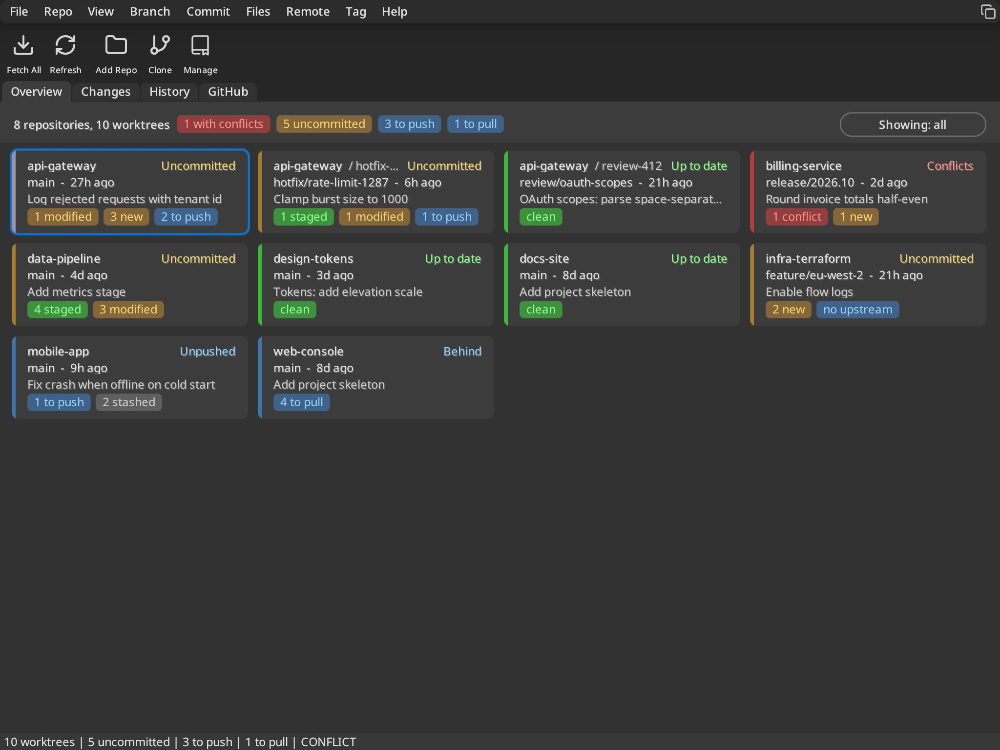
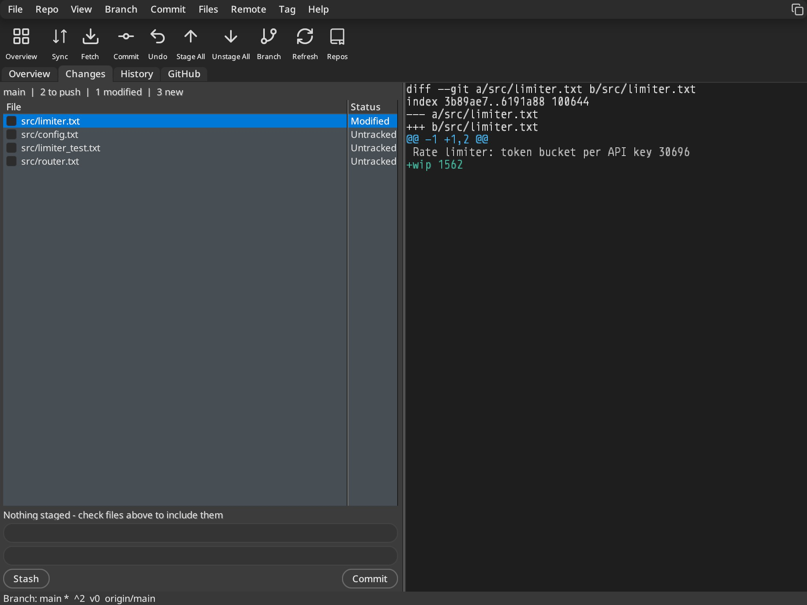

# Git Client

A SmartGit-style repository viewer built with the Orion UI framework.

## Menu tree as the application map

`gitclient.orion` treats the menu tree as the complete map of user-facing Git
capabilities. Each menu item declares one action and may declare its default
keyboard shortcut with `shortcut="..."`. Toolbars and context menus reference
those actions with fully qualified `command="group.action"` values; they never
create separate command IDs.

If a new user operation cannot be represented by an existing menu item, add the
menu item first, then expose it on other surfaces as needed. This gives menus,
toolbar buttons, context menus, keyboard shortcuts, and tests one shared action
identity.

## Two modes: Overview and Focus

**Overview** (Ctrl+0) is a board of tiles, one per repository *and* per linked worktree, so nobody has to
switch between them through a dropdown. Each tile shows only what needs a decision: uncommitted files
(staged / modified / new), unpushed and unpulled commits, conflicts, stashes, and whether the branch is
published. A colour stripe gives the verdict at a glance: red conflicts, amber uncommitted, blue needs
push/pull, green in sync. Diffs are deliberately absent.

| Input | Action |
|---|---|
| Arrow keys | move between tiles |
| Enter / double-click | open the tile in Focus mode (Changes if dirty, otherwise History) |
| Ctrl+0 | toggle Overview and the last Focus page |
| Ctrl+Shift+R | fetch every repository in the background |
| "Showing" pill | filter to tiles that need attention |

**Focus** is the classic single-repository view (Changes, History, GitHub). It now opens with a summary
line (branch, to push/pull, staged/modified/new counts), tells you what Commit will do
("Commit 3 staged files" or "Nothing staged"), and has an Overview button on every page.

The page is built from framework controls only (`view_overview.c`): a `TileGrid` of `Card`s, each holding Labels
and a `FlowView` of `Badge`s, so wrapping, truncation and row heights come from auto-layout. The app feeds it
`git_summary_t` rows (`git_workspace_scan` in `git_backend.c`). Pass two or more paths on the command
line (or `--overview`) to get a temporary, unsaved workspace:

```bash
apps/gitclient/share/demo/make_workspace.sh /tmp/ws      # eight demo repos + two worktrees
build/bin/gitclient $(cat /tmp/ws/paths.txt)              # Overview
build/bin/gitclient /tmp/ws/work/api-gateway              # Focus
```




## Architecture

The application follows a **database-driven** pattern where the model layer defines data structures and the UI auto-populates from the database. Views contain minimal code — almost no manual population loops, no array management, no hardcoded column setup.

```
Git repo (.git/) ──git CLI──► git_backend.c ──► database_t (in-memory cache)
                                                       │
                                              ┌────────┼────────┐
                                              ▼        ▼        ▼
                                          branches  commits   files
                                          table     table     table
                                              │        │        │
                                              └────────┼────────┘
                                                       ▼
                                              TableViews (auto-populated)
```

### Key principle: the UI doesn't know about git

Views are bound to database columns in `gitclient.orion`. When you call `send_message(win, tvRefresh, 0, NULL)`, the tableview fetches records from the database and renders them automatically. No iteration, no column setup, no manual population.

## Files

| File | Purpose |
|------|---------|
| `gitclient.orion` | Declarative schema, capability map, shortcuts, toolbars, forms |
| `datasource/gitclient_db.c` | Database procedure — in-memory tables populated from git |
| `datasource/changes_database_proc.c` | Changes-tab adaptor — working-tree files from git status |
| `datasource/github_database_proc.c` | GitHub adaptor — issues and PRs from the gh CLI |
| `controller.c` | Business logic — `gc_load_from_git()`, stage, commit, branch |
| `git_backend.c` | Git CLI wrapper (popen-based) |
| `view_main.c` | Main window proc — event routing only |
| `view_diff.c` | VGA diff viewer (custom rendering) |
| `view_menubar.c` | Command dispatch |
| `dialogs/dlg_*.c` | Dialogs using generated forms |

## How it works

### 1. Schema in `.orion`

```xml
<databases>
  <database name="db" class="gitclient_db">
    <table name="commits">
      <field name="hash" type="string" length="41"/>
      <field name="author" type="string" length="64"/>
      <field name="date" type="string" length="20"/>
      <field name="subject" type="string" length="256"/>
    </table>
  </database>
</databases>
```

The compiler generates `db_commit_t`, `ID_DB_COMMITS`, `commits_fields[]`, etc.

### 2. Form binding in `.orion`

```xml
<form name="main_window" width="800" height="480"
      role="host" flags="toolbar,statusbar">
  <TabView name="views">
    <StackView name="history_tab" text="History" />
  </TabView>
</form>

<form name="history_page" width="800" height="440" role="page">
  <Toolbar>
    <Button command="branch.new" icon="git-fork" text="Branch" />
    <Button command="repo.search" icon="search" text="Search" />
  </Toolbar>
  <TableView name="log" source="db.commits">
    <Column field="subject" title="Subject" width="0" />
    <Column field="author" title="Author" width="110" />
    <Column field="date" title="Date" width="90" />
  </TableView>
</form>
```

No C code is needed for column setup. The tableview reads field IDs from the
form definition. When the History page is selected, the host projects its
nested toolbar into the host toolbar.

### 3. Populate from git

```c
void gc_load_from_git(void) {
    // Clear tables
    send_db_message(gc->db, dbDelete, ID_DB_COMMITS, (void*)(intptr_t)0);

    // Fetch from git and insert
    git_commit_t raw[500];
    int count = git_get_log(gc->repo, raw, 500);
    for (int i = 0; i < count; i++) {
        db_commit_t rec = {0};
        strncpy(rec.subject, raw[i].subject, sizeof(rec.subject) - 1);
        send_db_message(gc->db, dbInsert, ID_DB_COMMITS, &rec);
    }
}
```

### 4. Refresh

```c
void gc_refresh_all(void) {
    gc_load_from_git();  // populate DB from git
    send_message(gc->log_win, tvRefresh, 0, NULL);  // tableview auto-updates
}
```

That's it. No array bounds checking, no max count limits, no manual iteration.

## Database as query layer

The database is **not persisted** — git is the source of truth. The database is a structured cache that views query uniformly:

```c
// Fetch all commits
result_node_t *commits = send_db_message(gc->db, dbFetch,
    MAKEDWORD(ID_DB_COMMITS, 0), (void*)(intptr_t)0);

// Find specific record
db_branche_t *branch = send_db_message(gc->db, dbFind,
    MAKEDWORD(ID_DB_BRANCHES, ID_DB_BRANCHES_NAME), (void*)"main");

// Free result lists
free_result_list(commits);
```

## Dialogs

Dialogs use generated forms. The view file is just an event handler:

```c
bool gc_show_commit_dialog(window_t *parent, bool amend) {
    commit_dlg_state_t st = { .amend_requested = amend };
    show_dialog_from_form(&gc_commit_dialog_form, "Commit", parent,
                          commit_dlg_proc, &st);
    return st.result;
}
```

The form definition (`gc_commit_dialog_form`) is generated from the `.orion` file — controls, layout, button IDs, all declarative.

## Building

```sh
make build/bin/gitclient
```

The build system:
1. Runs `orionc` to generate `build/generated/apps/gitclient/gitclient.h` from `gitclient.orion`
2. Compiles the GitClient sources in `apps/gitclient/` into one executable

## Adding a new data source

1. Add table to `gitclient.orion`:
   ```xml
   <table name="tags">
     <field name="name" type="string" length="128"/>
     <field name="hash" type="string" length="41"/>
   </table>
   ```

2. Add fetch logic to `controller.c`:
   ```c
   git_tag_t raw[128];
   int count = git_get_tags(gc->repo, raw, 128);
   for (int i = 0; i < count; i++) {
       db_tag_t rec = {0};
       strncpy(rec.name, raw[i].name, sizeof(rec.name) - 1);
       send_db_message(gc->db, dbInsert, ID_DB_TAGS, &rec);
   }
   ```

3. Add a `<TableView source="db.tags">` to a form.

No view code to write. The tableview auto-populates.
