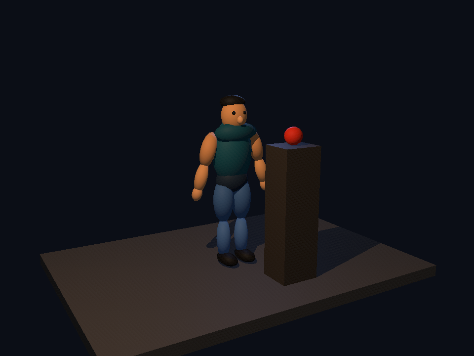
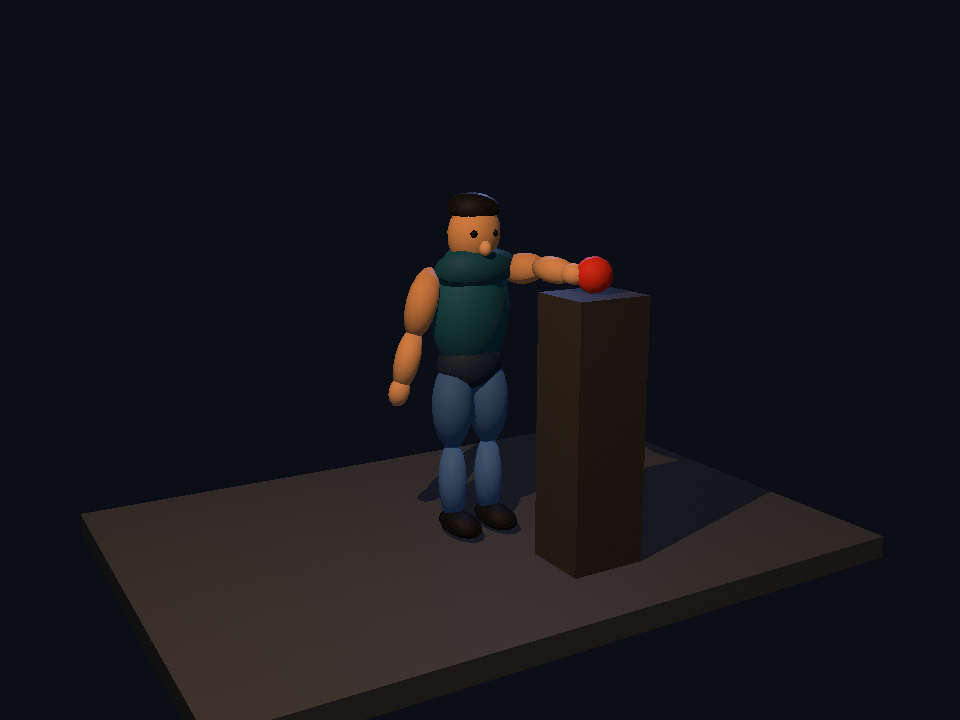
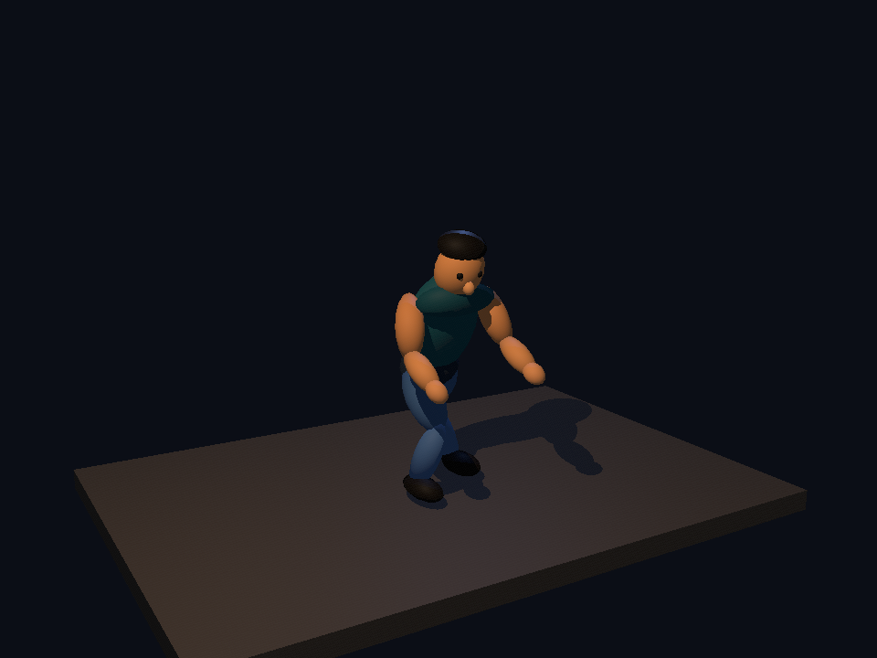

# Ellipsoid character and pose study

This study uses the supplied Ecstatica and Urban Decay images as visual references and the supplied `ecstatica.iso` as data. It does not include assets copied from the game.

## Scener experiment

[`ellipsoid_actor.blk`](../prefabs/characters/ellipsoid_actor.blk) is an approximately 180 cm character assembled from 21 nonuniformly scaled spheres. Nested groups place pivots at the hips, knees, ankles, shoulders, elbows, torso, and head. [`character_pose_study.blks`](../scenes/character_pose_study.blks) uses one instance and three camera-specific sets of joint transforms. The marker gives the reaching hand a concrete target.

| Standing | Reaching | Crouching |
| --- | --- | --- |
|  |  |  |

This proves that spheres, nonuniform scale, groups, and per-camera transforms can produce a character and distinct still poses today. The pose is assembled by editing many Euler angles. Reaching required moving the target into the arm's achievable range and manually aligning the shoulder and elbow. Crouching required coordinated root, hip, knee, ankle, torso, and arm edits; foot contact and silhouette remain sensitive to small changes. The joints are implicit in XML groups, with no dedicated character editing UI.

The renders above were produced by Scener on an Apple M1 GPU with stencil shadows. The character is intentionally simple; the test measures pose authoring and ellipsoid rendering rather than final character art.

## What the ISO establishes

The ISO is an ISO 9660 disc with `CODE/ECSTATIC.FAN`, `FILES/ECSTATIC`, `FILES/ECST2`, `OFFSETS`, and `OFF2`. `ECSTATIC.FAN` starts with `FANT` and contains NUL-terminated names of character parts, including `Right hand`, `Left forearm`, `Left thigh`, `Right shin`, `Head`, and facial components. It also contains action names such as `walk 7`, `walk backward`, `run 3`, `standing ogerdinn`, and `jump ogerdinn`. This is direct evidence that the game identifies body parts and motion actions separately in its data.

`OFFSETS` and `OFF2` are each 14,100 bytes, or 3,525 big-endian 32-bit entries. `0xffffffff` marks an absent entry. Entries address records in `FILES/ECSTATIC` and `FILES/ECST2`, respectively. The full store has 2,531 present entries, including 2,168 beginning with `FANT`; the smaller store has 2,283 present entries, including 1,920 beginning with `FANT`. For example, full-store record 1 begins at byte 573 and is 8,103 bytes long, ending at the next indexed offset. [`ecstatica_index.c`](../../../tools/ecstatica/ecstatica_index.c) reproduces these counts and can extract one indexed record for further inspection.

The exact record fields, ellipsoid parameters, joint hierarchy, frame timing, and interpolation scheme remain undecoded. The names and offset tables do **not** establish that Ecstatica used inverse kinematics. Alain Maindron's [firsthand account](https://www.timeextension.com/features/the-story-of-ecstatica-the-groundbreaking-survival-horror-with-plenty-of-balls) confirms the team had a 3D editor for creating and animating these characters and valued smooth transitions between actions; it does not specify the stored binary layout or an IK solver.

To repeat the indexing without importing game data into the repository:

```sh
7z x -o/tmp/ecstatica-assets /path/to/ecstatica.iso OFFSETS OFF2 'FILES/*' 'CODE/*'
cc -std=c99 -Wall -Wextra -Werror -o /tmp/ecstatica_index tools/ecstatica/ecstatica_index.c
/tmp/ecstatica_index /tmp/ecstatica-assets/OFFSETS /tmp/ecstatica-assets/FILES/ECSTATIC
/tmp/ecstatica_index /tmp/ecstatica-assets/OFFSETS /tmp/ecstatica-assets/FILES/ECSTATIC 1 /tmp/record_1.bin
```

## Missing Scener capabilities, in implementation order

1. **An instance-scoped character rig and pose editor.** The current hierarchy and motion tabs have no controls. Camera transforms target plain names, so two instances of the same named rig would both respond to a joint override. Expose joints, pivots, parent links, and per-instance selection and rotation in the viewport. Start with forward kinematics and joint limits.
2. **First-class ellipsoids with correct shading normals.** A scaled sphere gives the desired geometry, but `mesh_transform()` rotates its normals without the inverse transpose needed for nonuniform scale. This becomes obvious on strongly stretched limbs. Store radii directly or correct the normal transform for all meshes. An ellipsoid primitive would also simplify authoring.
3. **Reusable poses and animation clips.** Camera overrides give useful stills, but there are no pose assets, keyframes, interpolation, timeline, or time-based rendering. Geometry is baked into world-space meshes and shadow volumes are built at scene load, so moving characters need a retained local-space rig and updated transforms/shadows during playback.
4. **Target and contact constraints.** A two-bone IK solver for arms and legs would make hand-to-prop reaches and planted feet much faster and safer, especially when an actor or target moves. IK is not required for the standing or one-off reaching pose above. Add it after joints and clips exist, with forward kinematics remaining available for expressive animation.

Facial part controls, pose blending, and stylized squash/stretch can follow once the basic rig and clip pipeline works. The immediate blocker is an authoring and animation model for characters, rather than the ability to draw ellipsoids.
