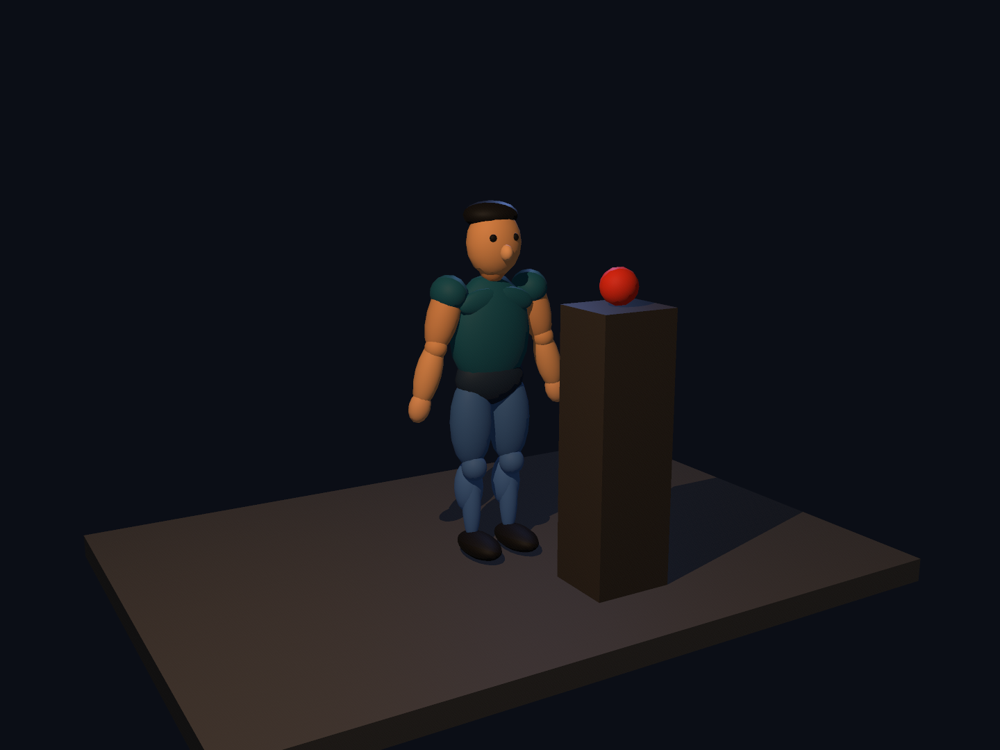
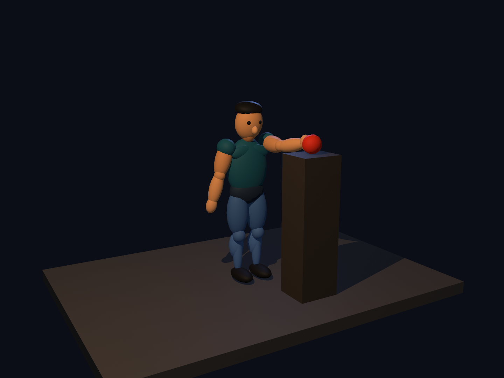
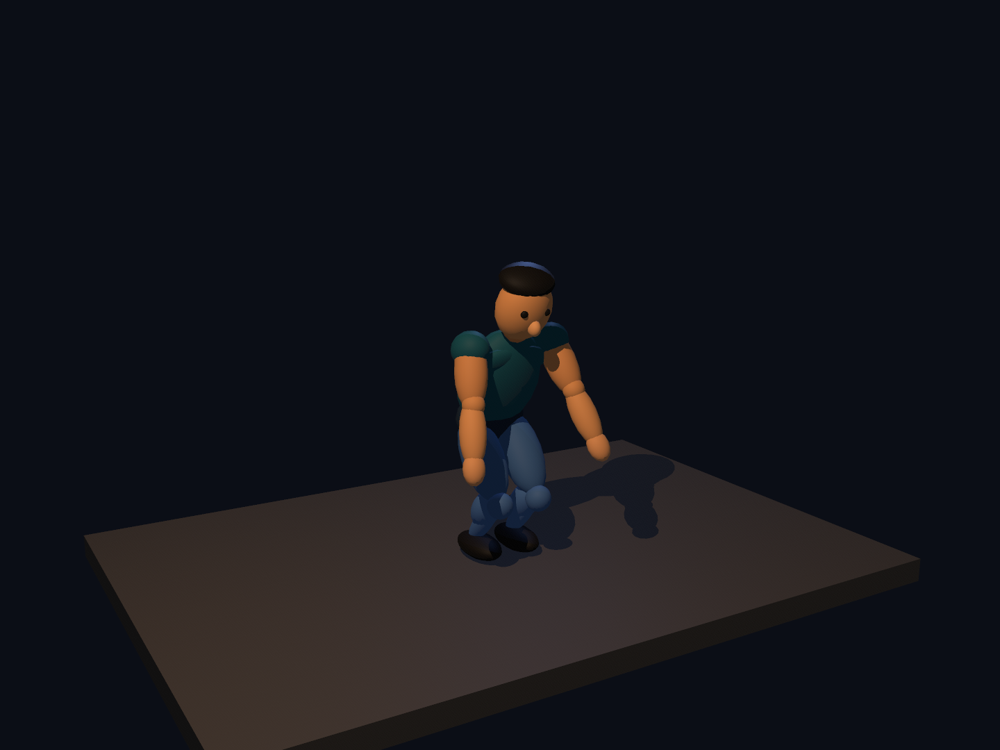

# Ellipsoid character and pose study

This study uses the supplied Ecstatica and Urban Decay images as visual references and the supplied `ecstatica.iso` as data. It does not include assets copied from the game.

## Scener experiment

[`ellipsoid_actor.blk`](../prefabs/characters/ellipsoid_actor.blk) is an approximately 180 cm character assembled from 30 true ellipsoid volumes. The pecs are shallow reliefs embedded in the upper torso. Separate shoulder, elbow and kneecap volumes cover articulations; posterior gastrocnemius volumes fill the upper calves above narrower shins and ankles. Hands are single mitten volumes, with no fingers, thumbs or digit joints. Named group joints retain compatibility with the existing saved poses. [`character_pose_study.blks`](../scenes/character_pose_study.blks) uses one instance, three reusable poses, and camera assignments. The marker gives the reaching hand a concrete IK target; both crouching feet use fixed world targets.

| Standing | Reaching | Crouching |
| --- | --- | --- |
|  |  |  |

The rig uses `rig_root → pelvis → torso → ribcage`: pelvis and ribcage are hubs, and the existing `torso` joint remains the spine control. The ribcage pivot is at chest height. Legs branch from the pelvis and arms from the ribcage; shoulder/elbow/hand and hip/knee/ankle remain direct two-link IK chains. Muscle volumes belong to their moving segment, so knees and calves follow lower-leg poses. The workflow keeps groups as the joint hierarchy and stores pose overrides per character instance. The reach uses a pole-directed two-bone solve. The crouch lowers the root while two leg chains keep their ankles at floor targets and preserve foot orientation. The editor's Hierarchy tab exposes joint selection, local transforms, pivots, pairing, targets, and named poses.

The renders above were produced by Scener on an Apple M1 GPU with stencil shadows. The character is intentionally simple; the test measures pose authoring and ellipsoid rendering rather than final character art.

## Rig and visual contract

Use [CAT’s modular hub/spine/limb organization](https://help.autodesk.com/cloudhelp/2023/ENU/3DSMax-Character-Animation/files/GUID-BB87B15F-7A2C-4C6F-AADF-3A5F2962549E.htm) for controls and the supplied Ecstatica screenshots for the volume language. This legacy group rig demonstrates static poses and two-bone IK. Scener also supports CAT role tags, layered animation, procedural gait and BVH retargeting; see [character-authoring.md](character-authoring.md) for that workflow. Digits are excluded from this biped.

Keep pecs broad and shallow rather than round projecting lobes. Keep knees visible when straight and bent. Calves need a posterior upper bulge with a narrowing ankle, not a single uniform shin oval. Review front, side and three-quarter views plus the reach and planted crouch before accepting anatomy changes.

## Decoded Ecstatica reference

The supplied ISO has now been decoded beyond names and offset tables. See the [binary format and anatomy report](../../../tools/ecstatica/FORMAT.md) and [complete actor/action catalogue](../../../tools/ecstatica/CATALOG.md). The reproducible [decoder](../../../tools/ecstatica/ecstatica_decode.py) reads all 4,088 indexed FANT records across both stores, plus the main file, without trailing bytes. It recovers 323 distinct indexed actor definitions containing 6,678 parts; both stores contain identical actor geometry.

Actor 0 (`fdinhe`, record 1000) has 43 parts, 11 head attachment points and five triangles. Its chest halfaxes are `(68,112,56)`; each pec is `(64,68,48)` with attachment `(±16,-32,8)`. These are broad, overlapping volumes with little additional forward extent. Knees `(24,28,40)` and calves (`molet`, `(28,32,56)`) are separate children of the shins `(20,24,116)`. Hands are single volumes; this actor has no digit parts. Some stored left/right shoulder and calf names disagree with their actual parent limbs, so the catalogue preserves both IDs and names.

These are exact raw dimensions, not centimetres. The report also documents limb-constraint flags/commands, all action key headers, palette and background encodings, and an equation reproducing every depth word in the 128×128 sphere lookup. Runtime IK, Euler conventions, interpolation and physical scale remain explicitly unverified; structural decoding is not a claim to have recreated the entire game engine. Our Scener model remains authored geometry guided by these findings and the supplied screenshots.

## Current Scener capabilities and limits

1. **Instance-scoped rig and pose editing is available.** The Hierarchy tab edits joints on a selected prefab instance, provides explicit pairing and mirroring, and saves named poses. Legacy camera `<transform>` still targets names globally; use `<use-pose>` for independently posed instances.
2. **First-class ellipsoids and constraint skeletons are available.** `<ellipsoid>` and `<bone>` volumes generate their own normals from the implicit surface, so stretched parts shade correctly. `<bone>` skeletons replace xyz placement with direction, length, girth and surface attachment, and add mirroring, segmented chains, grounding and tip-only or planted IK; see [character-authoring.md](character-authoring.md). Other legacy group rigs that still use scaled `<sphere>` parts retain the uncorrected normal transform; this actor now uses `<ellipsoid>` throughout.
3. **Animation clips are now available.** Scenes have a timeline: `<gait>` walks, `<layer>` poses and keyed `<clip>` entries blend over time, render with `--frames`, and play in the editor (see [character-authoring.md](character-authoring.md#animate-over-time)). Each frame still rebuilds world-space meshes and shadow volumes; with hashed shadow edges a character scene rebuilds in under 10 ms.
4. **Contact is world-target based.** An explicit target, or `plant="1"` at the rest position, pins a hand or foot while the body moves. A live constraint to a moving prop, automatic ground detection, joint angle limits, and multi-chain whole-body balance remain future work.

These renders exercise static pose authoring. Layered animation and capture workflows are documented separately in [character-authoring.md](character-authoring.md#animate-over-time); full-body balance and soft-tissue deformation remain outside this study.
