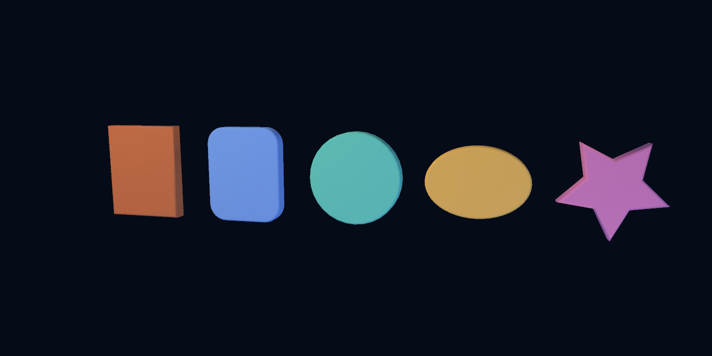
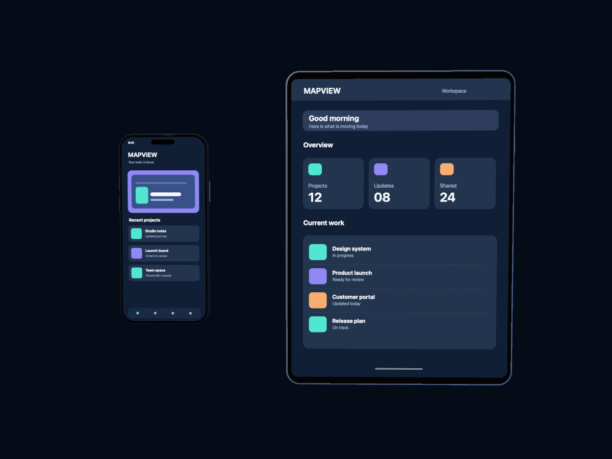

# Device promo scenes

Scener includes reusable, stylized [iPhone 18](../prefabs/devices/iphone18.blk)
and [iPad](../prefabs/devices/ipad.blk) models. Their local +Z axis faces the
viewer. Dimensions are illustrative, so the models work as promo props rather
than hardware specification references. Each model has a rounded, beveled body, bezel,
thin image-backed screen, and a few device details.

The sample scenes provide [phone](../scenes/iphone18_promo.blks),
[tablet](../scenes/ipad_promo.blks), and [combined](../scenes/device_promo.blks)
camera setups. The individual scenes contain `Front`, `ThreeQuarter`, and
`Close` cameras; the combined scene contains `Both`. The bundled sample
images are placeholders for app screenshots.

## Replace a screen image

Capture an app screenshot as PNG or JPEG. Crop it to the visible screen ratio:
about 0.452 for the phone and 0.727 for the tablet in portrait orientation.
Then edit the prefab instance in a `.blks` scene:

```xml
<prefab source="devices/iphone18" screenImage="/absolute/path/to/phone-screenshot.png"/>
<prefab source="devices/ipad" screenImage="/absolute/path/to/tablet-screenshot.png"/>
```

Relative paths start at the scene asset root (the directory containing the
`scenes/` and `prefabs/` folders). The property browser exposes `Screen Image`
on a prefab instance and `Image` on a screen inside a prefab. The instance
override lets multiple copies of the same model display different apps.

The screen uses sRGB image colors without scene lighting. The body and bezel
still respond to the scene lights. PNG transparency is supported on the
screen. For an edge-to-edge screenshot, include the status bar, system chrome,
and intended safe areas in the source image; the phone prefab adds its camera
island in front of that image.

The device bodies use reusable 2D profiles and modifiers:

```xml
<rounded-rect size="7.6 16.2" radius="1.28">
  <extrude amount="0.8"/>
  <bevel amount="0.16" bevelSegments="4"/>
</rounded-rect>
```

The same extrusion and bevel work on `<rect>`, `<circle>`, `<ellipse>`, and
`<star>` profiles. The Create menu and Create panel offer all five profiles
and a `Screen`. They create source nodes that persist in `.blks` files. The
screen stays flat so the screenshot remains undistorted.

[Profile examples](../scenes/profile_shapes.blks) include `Front` and `Angle`
cameras to inspect the outline and bevel on each shape.



## Render

From the repository root:

```sh
make scener
./build/bin/scener --list-cameras apps/scener/scenes/iphone18_promo.blks
./build/bin/scener --render apps/scener/scenes/iphone18_promo.blks \
  --camera Front --size 1200x1600 --format png --output-dir /tmp/phone-promo
./build/bin/scener --render apps/scener/scenes/ipad_promo.blks \
  --camera ThreeQuarter --size 1500x1200 --format png --output-dir /tmp/ipad-promo
./build/bin/scener --render apps/scener/scenes/device_promo.blks \
  --camera Both --size 1600x1200 --format png --output-dir /tmp/device-promo
```

Change camera position, FOV, background, and lights in a scene without editing
the device `.blk`. Copy a scene when a campaign needs a different stage or a
new group of camera angles. The screenshot surface follows the prefab's full
transform, including rotation and scale.


