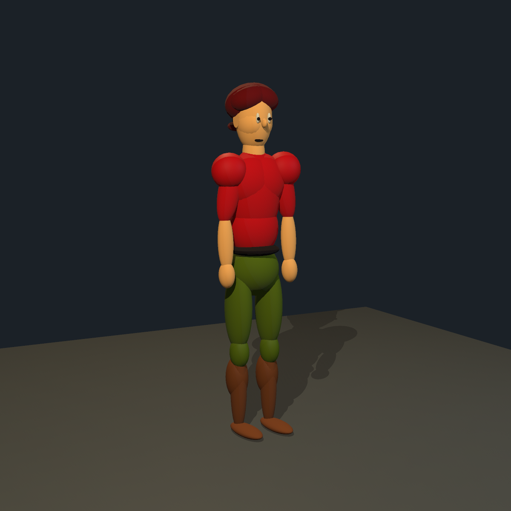
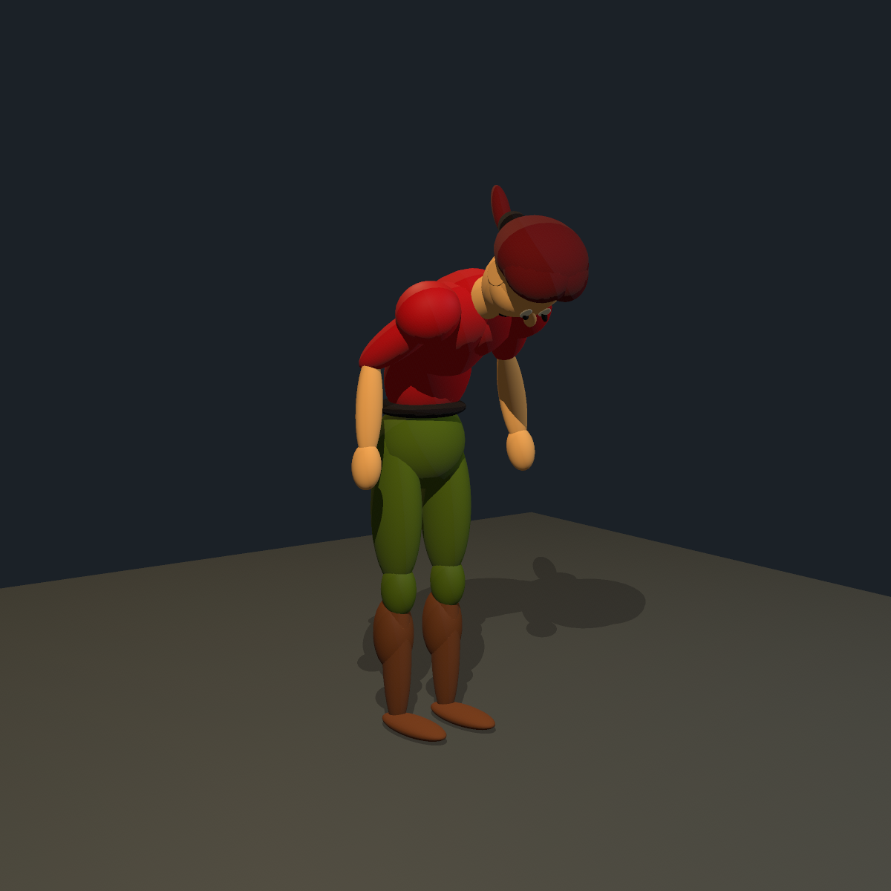
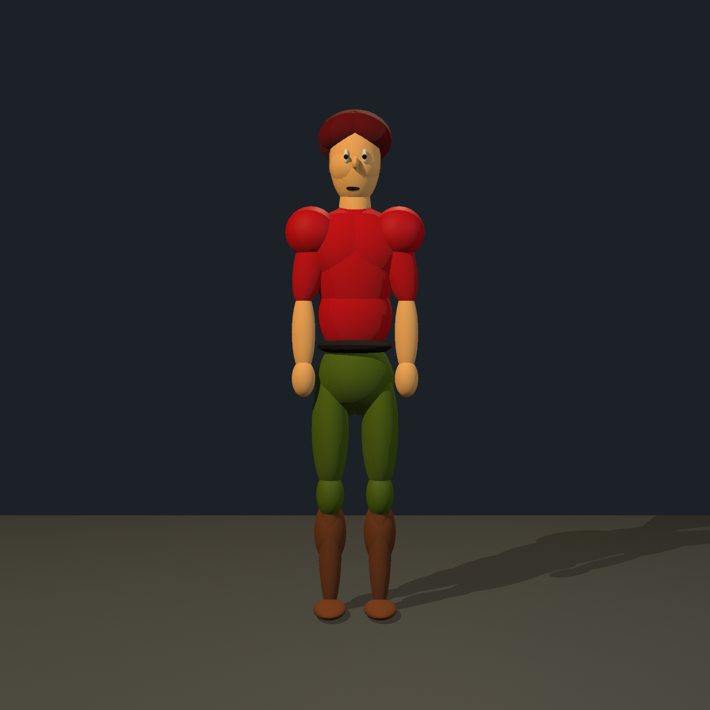
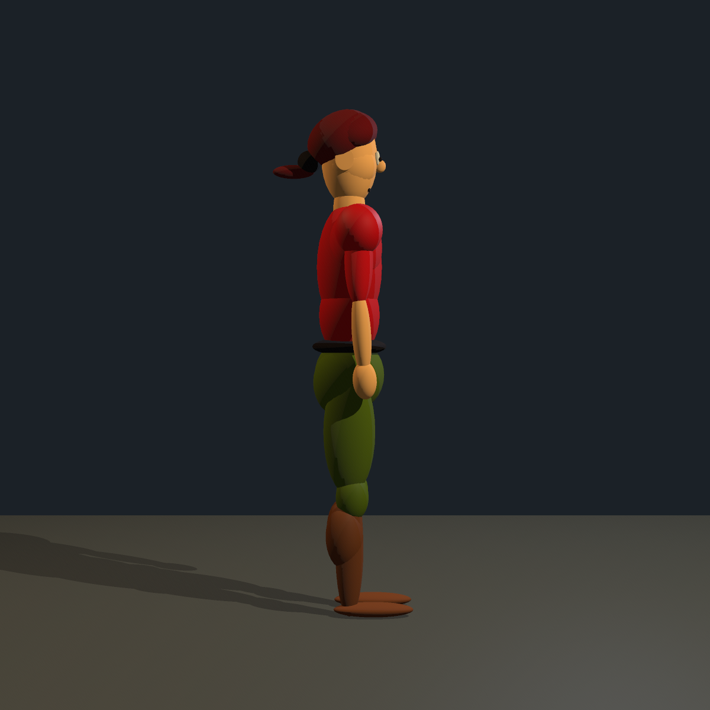

# Ecstatica biped with an articulated torso

[Open the scene](../scenes/ecstatica_biped_study.blks) · [Reusable prefab](../prefabs/characters/ecstatica_biped.blk) · [Decoded source format](../../../tools/ecstatica/FORMAT.md)

This example uses the decoded `fdinhe` actor (full-store record 1000) as its dimensional reference. It has separate **pelvis, abdomen and ribcage bones**, followed by neck and head. The abdomen and ribcage each carry a visible overlapping volume and an independent pose control. Arms follow the ribcage; legs follow the pelvis. Bending the upper body therefore does not move the standing feet.

The result is a Scener adaptation with verified source dimensions, not an exact reconstruction of Ecstatica's executable. In particular, the added abdomen, neutral joint placement, bilateral mirroring, nose, materials and lighting are authored adaptations. The original joint solver, pose transforms and lookup-based shading have not been reproduced.

## Scale and design

The study is a neutral studio turntable: one character stands on the floor, then demonstrates a forward bend and an upper-body twist. The only other mesh is its floor support. Lights represent studio key, fill and rim sources. Front and side views are diagnostic; the three-quarter views show the overlapping volumes and articulation.

The body frame is Z up, front −Y, character left +X. The root automatically grounds both feet on Z=0. The chosen uniform conversion is **0.207 cm per source unit**, giving an approximately 180 cm character, around 45 cm across the shoulder masses. This is an authored scale, not a recovered real-world unit from the game. The character occupies roughly 70% of the review frame height, with hands, knees, boots and the head unobscured.

All geometry placement inside the skeleton uses bone `aim`, `length`, `radius`, `at`, `from`, `sink` and surface `on` constraints. There are no hand-positioned group joints, xyz positions or nonuniform scales. Left limbs are authored once with `mirror="1"`. Three hair rotations are mapped from the source angle words as a visual basis conversion; the game Euler convention remains unverified.

## What matches the source

Thirty individually authored volumes were numerically compared to record 1000 and match its three halfaxes at the same uniform scale, within 0.00002 cm of decimal serialization. Mirrored copies inherit these dimensions. The check includes the pelvis, chest, neck, head, limb segments, feet, hands, knees, calves, deltoid, pecs, buttocks, belt, hair, cheeks, eyes, pupils, mouth and ponytail pieces.

Representative dimensions below are **halfaxes**, not diameters. Bone rows are listed as side / other cross radius / longitudinal radius; surface shapes follow their own axes.

| Volume | Source halfaxes | Scener halfaxes in cm |
| --- | --- | --- |
| Pelvis | 64,60,64 | 13.248,12.42,13.248 |
| Chest/ribcage | 68,56,112 | 14.076,11.592,23.184 |
| Pectoral | 64,48,68 | 13.248,9.936,14.076 |
| Deltoid | 44,40,44 | 9.108,8.28,9.108 |
| Upper arm | 24,28,80 | 4.968,5.796,16.56 |
| Forearm | 20,16,72 | 4.14,3.312,14.904 |
| Hand | 20,20,32 | 4.14,4.14,6.624 |
| Thigh | 32,44,108 | 6.624,9.108,22.356 |
| Shin | 20,24,116 | 4.14,4.968,24.012 |
| Knee | 24,28,40 | 4.968,5.796,8.28 |
| Calf | 28,32,56 | 5.796,6.624,11.592 |
| Foot | 28,12,68 | 5.796,2.484,14.076 |
| Head | 44,48,80 | 9.108,9.936,16.56 |
| Neck | 28,28,72 | 5.796,5.796,14.904 |

For a bone with tip-connected children and a bone parent, its rendered longitudinal radius is `length/2 + overlap`. For an end bone it is `(length + overlap)/2`; the root starts at zero instead of `-overlap`. These extensions are included in the dimension audit. Comparing only `length/2` would incorrectly report the rendered sizes.

Pecs are broad and deeply embedded in the ribcage. Kneecaps and posterior calves are distinct shin children. Deltoids follow the upper arms. There is one mitten volume per hand and no fingers or thumbs. Source left/right naming inconsistencies are resolved into anatomical left/right names in this authored rig, while the raw catalogue preserves the original labels.

## Deliberate adaptations

- The new abdomen adds a second torso articulation underneath the source-sized chest. Its halfaxes are 13.248 × 10.8 × 15.3 cm. The volumes overlap to close the waist during bends.
- The rest pose and joint distances fit our constraint skeleton; they are not the original stored pose solved by Ecstatica's runtime. The overall silhouette is consequently an adaptation even where each part's radii match exactly.
- Mirrored limbs remove the source's small left/right pose and hand-placement asymmetries. Torso controls are named `abdomen` and `ribcage`, separate from `pelvis`.
- The original head triangles are represented by a small ellipsoid nose in this example. Two zero-width source ears receive a 0.072 cm thickness so the mesh is nondegenerate. The belt-side patch and source `secret piece` are omitted.
- Red clothing, olive trousers, brown boots and the face/hair palette follow the supplied images. Scener's light/shadow renderer supplies the shading; the original palette lookup/rasterizer is not emulated.
- This example supplies static poses rather than animated clips. Scener supports timelines, layered clips and procedural gait, but this study does not reproduce Ecstatica’s original runtime interpolation, soft-tissue deformation or ponytail gravity.

## Poses and rendered review

| Standing | Forward bend | Twist |
| --- | --- | --- |
|  |  |  |

| Front | Side |
| --- | --- |
|  |  |

The `Bend` pose re-aims the abdomen and ribcage from 90° to 65° each, producing a distributed 50° forward bend. The neck and arms adjust with the gesture. `Twist` distributes 18° and 22° of yaw between those torso controls and raises the left forearm. Both poses keep the pelvis and leg chains at rest, so the feet stay planted without an unnecessary IK solve.

Review results: one actor appears in every camera; standing front and side views show the distinct knees and calves; hands have no digits; the pecs remain close to the torso; waist volumes remain joined during the bend and twist. Both feet touch the floor, with no `foot … rests` or `IK … out of reach` warnings. The floor and limbs produce readable contact/cast shadows. The neutral pose was also reviewed with zero ambient fill and `-d 8` to check the lighting and blocking.

## Run and validate

From the repository root:

```sh
scener apps/scener/scenes/ecstatica_biped_study.blks
scener --list-cameras apps/scener/scenes/ecstatica_biped_study.blks
scener --render apps/scener/scenes/ecstatica_biped_study.blks \
  --size 1200x1200 --format png --output-dir /tmp/ecstatica-biped
```

Select `Standing`, `Front`, `Side`, `Bend` or `Twist`. Select the `Ecstatica` instance in the editor's Hierarchy tab to pose `pelvis`, `abdomen`, `ribcage`, `neck`, `head` or the limb bones independently.

Validation on 2026-09-29: prefab and scene pass `xmllint`; the scene has no invalid ambient/background child tags; all five cameras load without warnings; the project builds; all 42 focused Scener tests and 13 decoder tests pass on the CAT rig PR branch. Final 1200×1200 images were rendered and inspected using the Apple M1 GPU with stencil shadows enabled.
