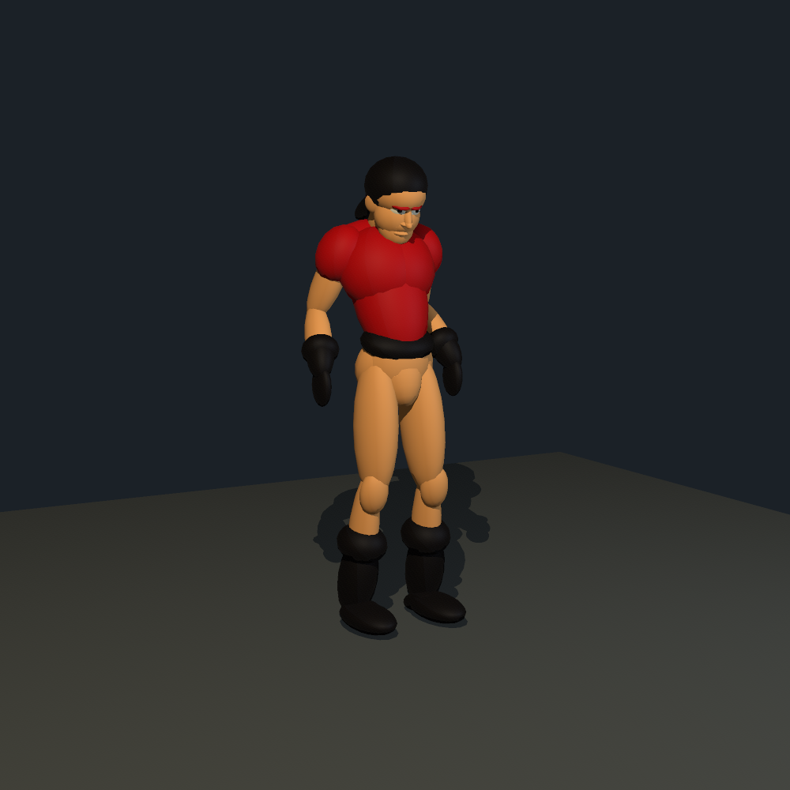

# Ecstatica character libraries

The [ISO importer](../../../tools/ecstatica/IMPORT.md) reads both games directly and exports original source records, Scener ellipsoid prefabs, editable CAT adaptations and experimental animation scenes. Each actor has its own portable `prefabs/` and `scenes/` folders.

## Start here

| Character | Original volumes | CAT adaptation | Animation sample |
|---|---|---|---|
| Ecstatica I protagonist | [Preview](examples/ecstatica1/scenes/preview.blks) | [CAT study](examples/ecstatica1/scenes/cat-study.blks) | [Walk](examples/ecstatica1/scenes/animations/0024-walk-7-start.blks) |
| Ecstatica II Joe | [Preview](examples/ecstatica2/scenes/preview.blks) · [Bare hands](examples/ecstatica2/scenes/bare-hands.blks) | [CAT study](examples/ecstatica2/scenes/cat-study.blks) · [Bare hands](examples/ecstatica2/scenes/cat-bare-hands.blks) | [Run](examples/ecstatica2/scenes/animations/0008-stherorun.blks) |

These small examples are included in Git, with decoded provenance and one original action each. The full converted library is local, ignored by Git, and reproducible from the supplied discs:

| Library | Actor records, including props | Source parts | Actions | Experimental clips | CAT adaptations |
|---|---:|---:|---:|---:|---:|
| [Ecstatica I](ecstatica/ecstatica1/README.md) | 323 | 6,678 | 669 | 1,456 | 93 |
| [Ecstatica II](ecstatica/ecstatica2/README.md) | 1,923 | 50,570 | 1,333 | 7,877 | 519 |

Use the inventories to browse characters; `manifest.json` is available for scripts. Source part fields and commands are preserved in JSON. Visible colours and pose interpretation are approximate. Clips use inferred transforms and normalized timing; they are not an emulation of the game runtime. CAT adaptations retain the source face but use Scener's neutral biped rig; imported clips currently target the source rig.

Gloves, boots, hair, fingers and explicitly named accessory volumes have per-instance XML options where present. Fingers and effects default off. See the importer guide for syntax and conversion limits.

```sh
scener apps/scener/imports/examples/ecstatica2/scenes/preview.blks
scener apps/scener/imports/examples/ecstatica2/scenes/bare-hands.blks
```

## Rendered review



[Ecstatica I protagonist](examples/review/ecstatica1.png) · [Same rig, bare hands](examples/review/joe-bare-hands.png) · [Imported motion preview](examples/review/joe-motion.mp4)

## Preserve the source appearance with CAT controls

Use [Ecstatica II Joe with calibrated controls](examples/ecstatica2/scenes/controlled.blks) or [Ecstatica I with calibrated controls](examples/ecstatica1/scenes/controlled.blks). The local libraries contain 542 such rigs. [Source-based character recipes](../characters/README.md) use the same control structure with independently editable height, frame, muscle and fullness. See [the design and validation guide](../docs/volume-characters.md).

## Multi-character animation review

[Joe, two villagers and a goblin](animation-review/README.md) include decoded actions, portable scenes and native GIF/MP4 previews.
