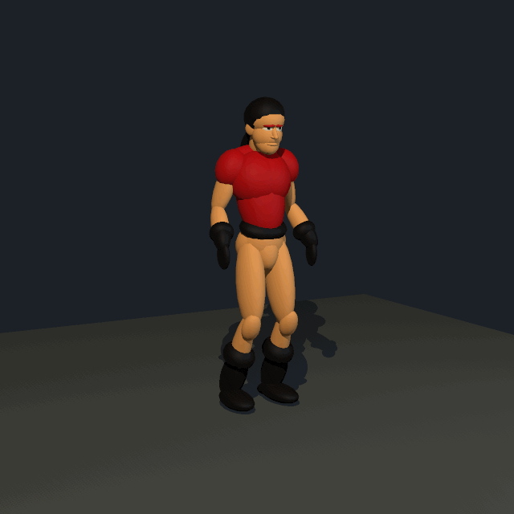
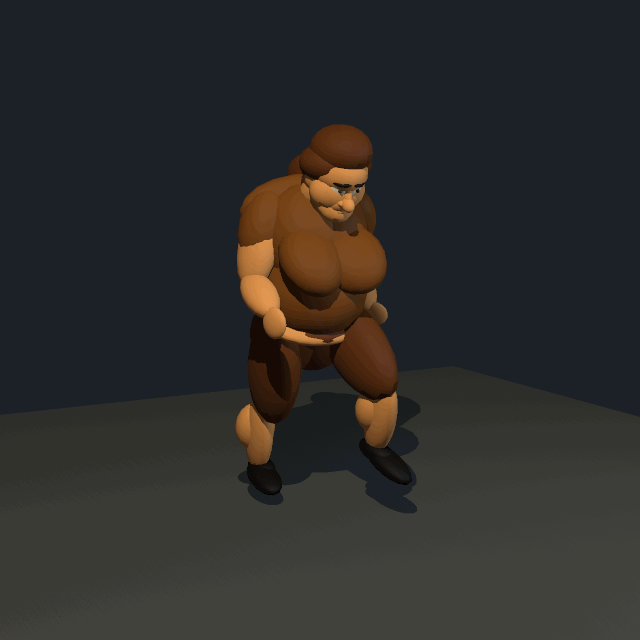
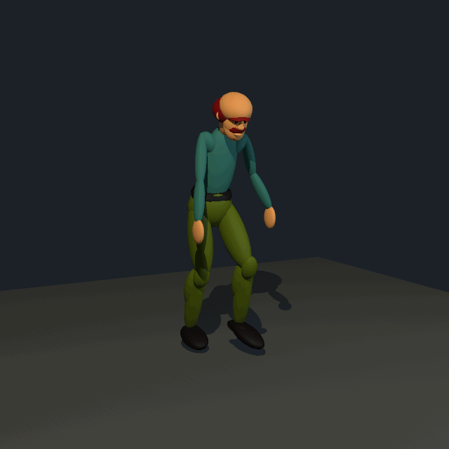
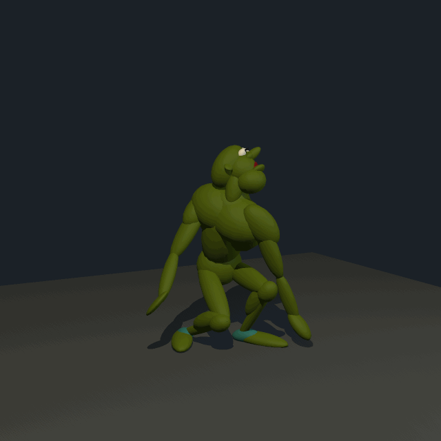

# Ecstatica II motion review

Four original actors with decoded action commands, portable Scener scenes and native rendered GIF/MP4 previews. Each sample contains 25 frames at 640×640, sampled at 24 fps over one normalized second. These are experimental reconstructed motions, not game-runtime playback: timing, root travel and some commands remain unimplemented. Each actor's conversion report lists omitted commands and unmapped parts.

| Actor / action | GIF | MP4 | Scene |
|---|---|---|---|
| Joe — stherorun (8) | [Run](joe-run/motion.gif) | [MP4](joe-run/motion.mp4) | [Scene](joe-run/scenes/motion.blks) |
| Fuller villager — vilwalk2 (958) | [Walk](full-villager-walk/motion.gif) | [MP4](full-villager-walk/motion.mp4) | [Scene](full-villager-walk/scenes/motion.blks) |
| Slender villager — vilwalk3 (960) | [Walk](slender-villager-walk/motion.gif) | [MP4](slender-villager-walk/motion.mp4) | [Scene](slender-villager-walk/scenes/motion.blks) |
| Goblin — gobswingfr (344) | [Swing](goblin-swing/motion.gif) | [MP4](goblin-swing/motion.mp4) | [Scene](goblin-swing/scenes/motion.blks) |






## Reproduce

From the repository root, with the full local ISO import available:

```sh
python3 tools/ecstatica/render_review.py \
  apps/scener/imports/ecstatica/ecstatica2 /tmp/e2-review \
  --scener "$HOME/.local/bin/scener" --frames /tmp/e2-review-frames
for name in joe-run full-villager-walk slender-villager-walk goblin-swing; do
  swift apps/scener/tools/frames_to_gif.swift \
    /tmp/e2-review-frames/$name Standing 24 /tmp/e2-review/$name/motion.gif
done
```

For an MP4, render the scene straight to video instead of encoding frames:
`scener --render SCENE --camera Standing --frames 0:END:24 --output motion.mp4`.

The output sample folders must be new; the renderer refuses to overwrite an existing sample. The scene, original action JSON, source actor JSON and conversion details are stored with every preview. No ISO is included.
