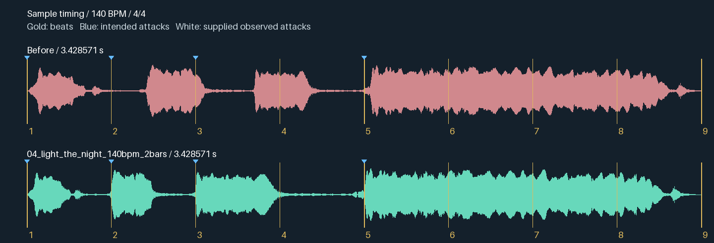

# Generating and verifying Groove samples

This is the workflow for creating original sample assets for Groove: vocals now,
and drums, bass, instruments, textures and effects later. A generated take is raw
material. It is not ready for the grid until its contents, attacks, duration and
actual playback decoder have been checked.

The waveform comparison pictures are **Python + NumPy + Pillow**, not ImageGen.
They are plots of decoded audio. NumPy measures samples; Pillow draws the peaks,
beat lines, labels and comparison rows. Diagnostic spectrograms use SciPy's STFT
and Pillow. No image generation, waveform illustration or drawing by eye is used.

## 1. Study the references and define the sample

Read the catalogue before opening clips:

- `apps/groove/ejay-samples/index.tsv`: product, musical family, variation, BPM,
  decoded frame count and path. Dance eJay families are the musical reference.
- `apps/groove/mtv-samples/index.tsv`: instrument pool and singer/kit, with the
  riff's genre in the `genre` column. Folder names alone do not establish genre.

Listen to representative clips when an audio audition is available, and inspect
their waveforms. Reading filenames or generator captions does not count as
listening. If the agent cannot hear audio, record that limitation and leave
auditory quality unverified. Keep commercial recordings and original titles out
of the delivered assets and app; use the references for roles and proportions.

Record these decisions before generation:

| Field | Example |
|---|---|
| Role | Isolated female vocal hook; no accompaniment |
| Tempo / meter | 140 BPM, 4/4 |
| Musical slot | One or two bars |
| Rhythm | Straight beats; attack positions `0, 1, 2, 4` in a two-bar clip |
| Sound | Clear alto, dry, single voice; original short lyric |
| Pitch | Requested key or note; verify separately if musically important |
| Start / end | Immediate first phoneme; complete phrase with a clean release |
| Delivery | Mono 44.1 kHz; PCM24 WAV master, gapless MP3 for current app |

Beat positions in data are **zero-based**; picture labels are one-based. Thus
`0, 1, 2, 4` means beats **1, 2, 3, 5** on the picture. The clip endpoint is not
an attack. Triplets, swing, pickups and offbeats require an intentional rhythm
plan. Do not introduce them just to squeeze a phrase into a shorter box.

### Slot length is different from sound length

At 140 BPM and 44.1 kHz:

| Unit | Seconds | Frames |
|---|---:|---:|
| Beat | 0.428571429 | 18,900 |
| Bar, four beats | 1.714285714 | 75,600 |
| Two bars | 3.428571429 | 151,200 |
| Four bars | 6.857142857 | 302,400 |

The Dance eJay payload allocates musical capacities; the decoded audio can end
before its slot. Only 671 of 1,352 files fill that capacity within 2%. The checked
Dance catalogue's median decoded duration was 3.384 seconds. That does **not**
mean every reference vocal lasts two bars, nor prove every detail of eJay's UI.
See [the container study](../../apps/groove/docs/dance-ejay-pxd.md#audio-payload).

Groove uses `block_t.bars` for box width and snaps placement to quarter-bars.
Its rendered buffer fills the slot. At other tempos, match the engine's rounding:

```python
bar_frames = int(44100 * 60 * 4 / bpm + 0.5) & ~3
beat_frames = bar_frames / 4
clip_frames = bars * bar_frames
```

Padding a short sound at the **end** can correctly fill a slot. Adding a silent
lead-in moves every attack late. Stretching a file to the right total length
does not by itself put its internal events on the beats.

## 2. Generate original raw takes

The October 2026 vocal batch used Runway's `generate_music` capability with
`model="lyria-3-clip"`. Confirm the connected account first. The interface exposes
a prompt, model and name, but no exact duration or MIDI-note schedule. Its output
is MP3. Treat tempo, duration, instrumentation and lyric instructions as requests
to verify, not enforced constraints. Tool availability and credit costs can change;
read the active tool description when running a new batch.

Lead the prompt with the isolated source. Mentioning a genre too prominently can
encourage the model to provide a complete arrangement. For example:

```text
DRY SOLO FEMALE A CAPPELLA SAMPLE. One unaccompanied adult woman in an
acoustically dead vocal booth. Clear, soulful alto. A short original melodic
hook, 140 BPM, 4/4. Sing only "Light the night". Single voice, no doubling.
No instruments, drums, bass, pads, backing vocals, reverb or delay. The tempo
is an internal reference, not an audible metronome. Begin with the first
phoneme immediately; no count-in or introductory silence. One complete short
take, not a song or repeated arrangement.
```

Preserve each raw download unchanged. Save the exact prompt, provider/model,
generation task ID, requested rhythm, output format and SHA-256 in the work
directory. Never commit temporary signed download URLs or account credentials.
Generated captions and lyric timestamps can repeat the prompt even when the
audio contradicts it. Use them only as search hints for candidate regions.

The [recorded batch recipe](sample-generation-2026-10-08.json) retains the exact
five prompts and edit parameters used here. Regeneration is not byte-for-byte
reproducible: retain the source takes if reproducing an edit matters.

### Other sound families

| Role | Request / production method | What to check |
|---|---|---|
| Drum or percussion hit | Single dry hit; existing Groove synth when suitable | Transient at the planned frame, full decay, no extra hits |
| Drum loop | Specific kit, isolated rhythm, exact intended hit pattern | Every hit, swing policy, bar endpoint, seamless repeat |
| Bass or lead | Solo instrument, explicit short motif and requested notes | Note attacks, actual pitch, tail, no backing arrangement |
| Chord stab | One isolated voiced chord, short release | Chord tones and attack, no hidden bass or drum layer |
| Pad or texture | Isolated sustained layer | Intentional slow attack, continuity, seam and tail; not a drum-onset test |
| Riser or impact | Clear destination beat and duration | Peak or impact at the target, not merely the beginning of noise |

Use the existing synth for deterministic notes and hit timing when it fits the
sound. Use a music generator for melodic material, or an available sound-effect
generator/recording workflow for individual noises. Do not apply vocal isolation
to drums, or remove every soft onset from a pad. Select processing by role.

## 3. Isolate the source and select a complete phrase

Use the setup in [README.md](README.md#setup). Keep raw audio, models, working
stems and rejected edits in the ignored `tools/groove_audio/work/` directory.
Use one separation process at a time on an 8 GB machine.

```sh
work_dir="$PWD/tools/groove_audio/work/new-vocals"
python tools/groove_audio/separate_vocals.py \
  "$work_dir/raw/take.mp3" --work-dir "$work_dir/isolated"
```

For this batch, Mel-Band RoFormer (`vocals_mel_band_roformer.ckpt`) used native
FP16, segment size 512, overlap 4, batch size 1 and segment-size override on MPS.
The five selected regions were concatenated with 0.5-second gaps for one run;
their offsets were recorded before splitting the vocal stem back into clips.
Separating individual takes is easier to audit and is also valid.

Preserve both the vocal and removed backing stems. Inspect and audition the
vocal stem alone: separation can leave leakage or damage consonants, and a model
labelling a stem "Vocals" does not prove no music remains. Do not normalize and
mix the removed backing into the output. Prefer regeneration if isolation ruins
the wanted source.

Choose a complete short phrase, not the entire generated file. Remove unrelated
introductions, repetitions, count-ins and long trailing silence. Preserve the
first phoneme and the release. Quiet consonants are not silence. A little vowel
onset after a leading consonant is normal; do not cut off an F or S merely to
make the tallest peak touch time zero.

## 4. Align events, then fit the slot

Write an edit map with **observed source times** and **intended beat positions**.
Identify the perceptual event appropriate to the role: consonant/voiced onset,
drum transient, pluck, or impact. Use waveform, spectrogram and listening together.
Do not use the source filename, requested BPM, or final file length as evidence
for those source times.

1. Select the musical rhythm first; use straight beats for this vocal set.
2. Time-stretch the intervals between landmarks while preserving pitch. The
   batch used FFmpeg `atempo` (WSOLA). The rate is `source_frames / target_frames`.
   Large changes need shorter edits or a new take, not extreme stretching.
3. Re-measure the processed attacks: WSOLA can change their offsets. The batch
   moved internal syllable segments earlier and crossfaded the overlap so their
   consonant lead-in was retained while the voiced attack landed on the beat.
4. Keep the complete release where possible; pad the tail to the exact slot or
   edit the release intentionally. Do not solve drift by truncating a word.
5. Apply tiny boundary fades to avoid clicks. The batch used 2 ms segment ramps
   and a 12 ms final fade, a gentle 55 Hz high-pass, and a -2 dBFS peak ceiling.
   These are vocal settings, not universal settings for bass or kick samples.

For one interval, the equivalent FFmpeg processing is:

```sh
ffmpeg -i interval.wav -af "atempo=1.25,apad,atrim=end_sample=18900" \
  -c:a pcm_f32le interval-fitted.wav
```

The example rate is illustrative. Compute it from the actual edit map. Editing
only the amplitude envelope does not retime sung notes. Plain sample-rate
resampling changes pitch and must not masquerade as pitch-preserving stretching.

### What went wrong in the first export

"Light the Night" originally used zero-based attack targets
`0, 1⅓, 2⅔, 4`, ending at beat 8. The file was exactly two bars long, but its
middle attacks were triplets against the requested straight grid. It was fixed
to `0, 1, 2, 4`, with the same two-bar endpoint. "Move With Me" also needed an
approximately 51 ms late internal attack corrected.

The subsequent "within 2 ms" result described an **envelope proxy**: the first
roughly 1 ms RMS bin above 18% of the local 210 ms window's maximum. That is useful
for comparing these edits, but is not proof of perceptual alignment. A forward
window can miss an early attack or mistake a sustained preceding note for the
new attack. Never label this measurement alone "all vocals verified on beat."

## 5. Export and test the actual decoder

Keep a 44.1 kHz PCM24 WAV master. The current app sample rows read MP3 from
`apps/groove/share/vocals/` via `mp3_decode.c` and `minimp3_ex.h`.

```sh
ffmpeg -i master.wav -c:a libmp3lame -b:a 320k -write_xing 1 \
  -id3v2_version 3 -metadata TBPM=140 sample.mp3
```

MP3 encoders add delay and padding. Xing/LAME gapless information allows a
supporting decoder to remove them. Verify using **Groove's decoder**, not only
FFmpeg or an OS player. `decode_sample.c` uses the same `MP3D_SEEK_TO_SAMPLE` path,
reports removed delay and dumps decoded PCM. `verify_sample.py` compiles it
against the current repository headers automatically.

`groove_mp3_load()` currently resamples the complete decoded sample to the
requested block frame count. It is not a beat detector or a pitch-preserving
tempo engine: wrong internal timing remains wrong, and changing project BPM
also changes sampled pitch. Validate the source at 140 BPM and test actual app
playback if it will be used at other tempos. This workflow does not change that
playback behavior.

## 6. Produce and inspect the verification images

Run from the repository root with the audio-tools Python environment:

```sh
python tools/groove_audio/verify_sample.py \
  apps/groove/share/vocals/04_light_the_night_140bpm_2bars.mp3 \
  --before "$work_dir/previous/04_light_the_night_140bpm_2bars.mp3" \
  --bpm 140 --bars 2 --attacks 0,1,2,4 --max-leading-ms 5 \
  --work-dir "$work_dir/verification/light-the-night"
```

Omit `--before` when there is no saved previous version. Outputs:

- `waveform-grid.png`: real decoded peak envelopes on a shared time and amplitude
  axis; gold beat lines, stronger bar lines and blue intended-attack markers.
- `verification.json`: file hash, actual decoder, sample rate, frame count,
  leading-signal measurement, envelope proxies and explicit pass/fail checks.

The script uses maximum absolute sample amplitude per image column, across
channels, so a short transient is not lost by plotting just every Nth sample or
by downmix cancellation. Before/after rows use the same scale. It never stretches
the picture to fit the box or independently normalizes rows to hide a difference.

This example was regenerated from the previous and corrected MP3s through
Groove's decoder. The middle attacks move onto the straight beat lines while
both files remain two bars long:



Check more than the rectangle width:

1. The first wanted sound starts promptly; preserve deliberate slow attacks.
2. Each intended syllable/hit/note aligns with its grid landmark.
3. There are no unintended triplets, silent intros, repeated hooks or extra hits.
4. Releases remain intact and the repeat boundary has no abrupt discontinuity.

For an independent timing check, annotate observed attack times in seconds from
the actual audio and pass `--observed-attacks` in the same order as `--attacks`.
White lines then show those observations; signed errors go into the JSON and
`--tolerance-ms` controls the check (default 5 ms). Do not copy intended times into
this argument: that would only test the plan against itself. First consonants
and soft attacks can require a different explicitly documented landmark.

Without supplied observations, exit status checks format, duration, finite
signal, peak level and optional leading signal **only**. Forward envelope-rise
values are diagnostic, not an independent alignment pass. A nice-looking image
cannot prove pitch, lyrics, absence of accompaniment, or acceptable edit quality.

For difficult boundaries, the diagnostic spectrogram used in this session was
`scipy.signal.stft`: 1,024-frame window, 896-frame overlap (128-frame hop), magnitude
in dB. Inspect harmonic changes, consonants and separated sources. A spectrogram
helps choose landmarks; it does not replace listening or establish a singer's
identity. The reusable checker draws waveforms; it does not currently generate
spectrograms or perform automatic musical transcription.

## 7. Audition, install and reload

Listen to the isolated sample, then alongside a 140 BPM click or simple kick
pattern over several repeats, then in Groove. Keep audition clicks in separate
review files; never mix them into delivered isolated samples. Check consonants,
pitch, artifacts, leftover backing, rhythm and loop seams. Record who auditioned
the result; if nobody did, mark listening verification pending.

Once accepted, keep the raw takes, edit maps, WAV masters, prompts, hashes and
verification outputs locally. Copy approved MP3s into `share/vocals/`, with the
corresponding `M(...)` rows in `library.c`. Preserve existing files before
replacement. Other families should use an appropriate framework/app sample
registration extension rather than being labelled vocals just to reuse a folder.

Run `make share` to stage resources, or copy the approved assets to the matching
`build/share/groove/vocals/` directory. Restart Groove to reload its rendered-audio
and waveform caches; a previously open app can still show and play old data.
Do not kill an app with an unsaved arrangement to force that reload. Audio-only
changes need decoder/timing/audition checks; control or decoder code changes also
need their relevant build and regression tests.

Delivery notes should name the folder, files, tempo, bars, actual checks and any
remaining listening review. Do not claim a generator's prompt constraints were
verified solely because the request succeeded.
